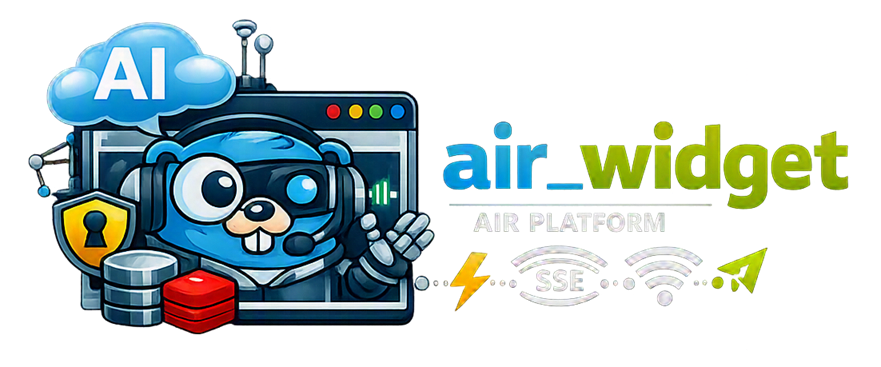

# AiR Widget



[🇷🇺 Russian version](README.ru.md)


[](https://t.me/marusia_dev)

`air_widget` is an AiR platform microservice that allows a web widget to be integrated into any website for user interaction with an AI assistant.

## User Data Protection

All user data is encrypted with an individual `MasterKey`. This key is available only through the user's password and encrypts dialog history, individual bot settings, and other user data. Data can be decrypted only after the user authenticates in the system with their personal password. Even in the event of a database compromise or leak, all user data remains inaccessible to both attackers and service administrators.

## Features

- starting, stopping, and restarting user widget instances;
- authorization and access-token renewal;
- restricting connections to a list of allowed domains;
- support for temporary and non-expiring widget configurations;
- message processing and dialog history retrieval;
- real-time delivery of assistant responses through Server-Sent Events (SSE);
- CRM integration and operator mode;
- encrypted storage of settings in MySQL and Redis;
- retrieving the user's `MasterKey` through gRPC;
- Prometheus metrics and graceful termination of active connections.

## Architecture

```text
Browser widget
        |
        v
   air_widget ---- MySQL
        |  \------ Redis
        |  \------ AiR Orchestrator (gRPC)
        \--------- AI model / CRM / Operator
```

Authentication is performed using JWT tokens. SSE is used to deliver events to the client.

## Authorization

JWT token issuance, renewal, and validation are performed by the main `air_orchestrator` service. `air_widget` communicates with it via RPC and uses the received tokens to authorize widget requests and establish SSE connections.

The widget code is also created and validated through RPC calls to `air_orchestrator`. `air_widget` itself is responsible for processing HTTP requests, checking the allowed origin, and operating active user widgets, but it is not a JWT token-signing service.

## Technologies

Go, Gin, MySQL, Redis, gRPC, JWT, SSE, Prometheus, Docker, and Docker Compose.

## Development

Use [`dev.yml`](dev.yml) to run the service:

```bash
docker compose -f dev.yml up --build
```

The development configuration connects the service to MySQL, Redis, and the AiR Orchestrator gRPC service, uses `localhost` as the public address, and enables debug logging.

## Configuration

Main environment variables:

```text
DB_HOST
DB_NAME
DB_USER
DB_PASSWORD
REDIS_ADDR
REDIS_PASSWORD
REDIS_DB
GRPC_CONFIG_HOST
REAL_URL
LOG_LEVEL
```

The production configuration is located in [`prod.yml`](prod.yml). The public address is passed through the `DOMAIN` variable.

## HTTP API and Monitoring

The service provides the following route groups:

```text
GET  /metrics

GET  /v1/widget/available
POST /v1/widget/exam
GET  /v1/widget/validate
POST /v1/widget/refresh
GET  /v1/widget/username
GET  /v1/widget/dialog
POST /v1/widget/data
GET  /v1/widget/events
POST /v1/widget/events-ticket
POST /v1/widget/code

GET  /widget/enable
GET  /widget/disable
GET  /widget/restart
```

The `/v1/widget/events` route is used for the SSE connection and real-time streaming of assistant events. The `/metrics` route provides Prometheus metrics, including HTTP requests, SSE connections, message processing, active dialogs, and widget lifecycle events.

The full API contract is available in [`doc/openapi.yaml`](doc/openapi.yaml).

## Docker

[`Dockerfile`](Dockerfile) builds a static Go binary in a separate build stage, compresses it with UPX, and runs it in a minimal `scratch` runtime image with CA certificates and time zone data.

## Related Services

- [air-common](https://github.com/ikermy/air-common) — common library for AI microservices;
- [air_orchestrator](https://github.com/ikermy/air_orchestrator) — main orchestration service;
- [air_operator](https://github.com/ikermy/air_operator) — service that forwards responses from users to operators and supports all bot types;
- [marusia_crm](https://github.com/ikermy/marusia_crm) — service for integration with external CRM systems;
- [air-logger](https://github.com/ikermy/air-logger) — event logging service with multi-user support and Loki collector support.

## License

The project is distributed under the [MIT License](LICENSE). It permits using, copying, modifying, and distributing the software provided that the license text and copyright notice are retained.

The full license text is available in [`LICENSE`](LICENSE).

## Contacts

[](https://t.me/ikermy)
